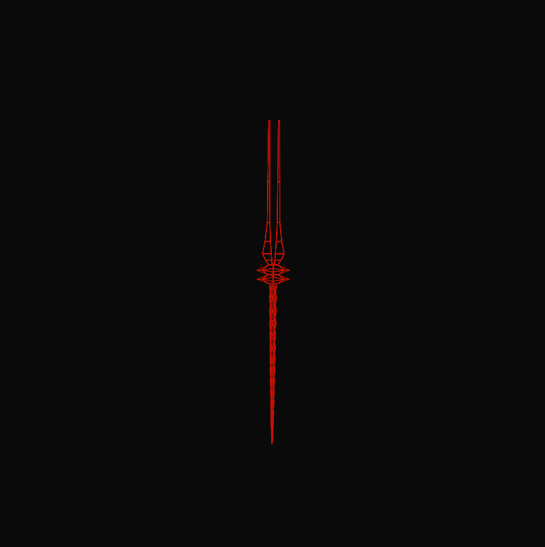
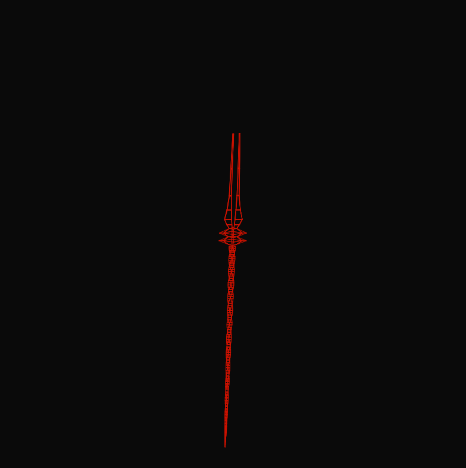
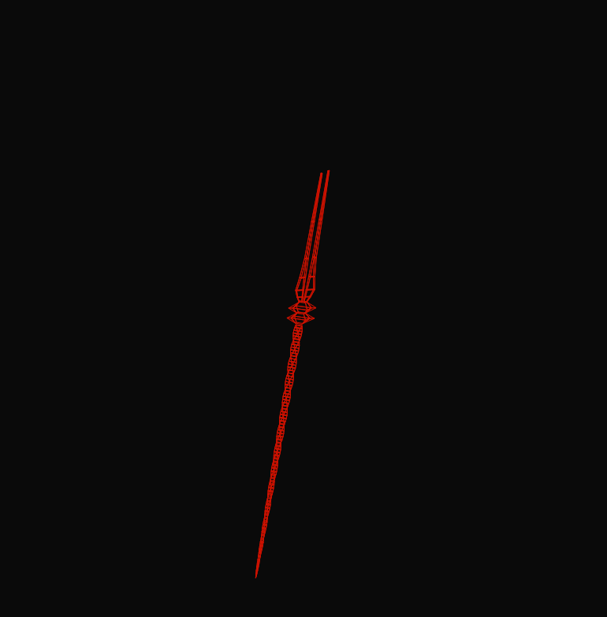

A 3D graphic renderer built from scratch using pure mathematical formulas — no WebGL, no Canvas 3D context, no external rendering libraries. Just math and pixels.
This project renders a 3D model of the Spear of Longinus from Neon Genesis Evangelion, with real-time rotation and projection, all driven by raw trigonometry and manual rasterization.

## Quick Start

```console
$ git clone https://github.com/aguiarcode/evangelion3dgraphic
$ cd evangelion3dgraphic
$ open index.html
```
| | | |
|---|---|---|
|  |  |  |

Highly inspired by [tsoding/formula](https://github.com/tsoding/formula):

